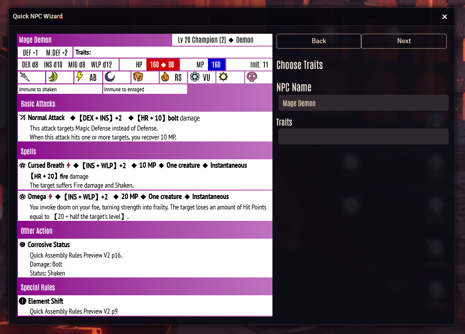

# Fabula Ultima Quick NPC Wizard

This module strives to implement the Creature Quick Assembly Rules from the preview document / the upcoming "Bestiary" in an easy to use fashion.
The wizard is accessible from the ProjectFU scene controls and the Actors tab.

## Installation
Use automatic Foundry module installation.\
Module Manifest:\
`https://github.com/League-of-Fabulous-Developers/fabula-ultima-quick-npcs/releases/latest/download/module.json`
